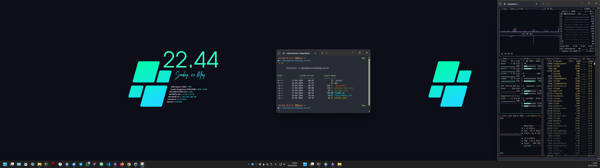

# :globe_with_meridians: init

 

$$
{{\color{Goldenrod}\Huge{ \texttt{ ...\ initializing\ symbiosis\ ... \}}}}\
$$

## hints
- :snowflake: jack of all trades
- :monkey: digging into the web [..] since macromedia dreamweaver
- :hammer: crafting pc-builds since geforce4 ti 4200
- :art: customizing fan since litestep shell
- :honey_pot: mechanical keyboard enthusiast
- 💾 dedicated gamer since doom 1
- :movie_camera: cinephile & :headphones: addicted to hiphop
- :cat2: are my cryptonite

## knowledge / xp / traits
| Segment    | Indicator | Synergy/Keywords |
| ---------- | --------- | -------- |
| HTML  |     | HTMX, Jinja, Pug/Jade |
| CSS |      | SASS/SCSS, Bootstrap, Tailwind |
| JS    |     | jQuery, NodeJS, Pug/Jade |
| PHP    |     | Wordpress |
| Python    |     | Flask, Jinja, Celery |
| Design & Prototyping    |     | Figma, Penpot, FontAwesome, Material Design |
| Backend/Databases/ORMs    |     | Redis, MySQL, SQLite  |
| CMS (+ headless)   |     | Wordpress, Kirby, Storyblok, TinaCMS, Ghost |
| DevOps    |     | Git, Docker, Vercel, Render |
| Dev Ecosystems    |     | Cloudogu, Cloud Foundry |
| SAP    |     | BTP, IAS, BAS, Cloud Foundry |
| XML    |     | XRechnung |
| Windows    |     | Main OS since forever ;( |
| Linux    |     | VPS and Self-Hosting (Custom Nginx + ModSecurity, Docker for N8N, Ghost, Grafana, Penpot)   |
| Shell/Terminal/CLI   |     | SSH, BTP CLI, CF CLI |
| Reading docs   |     | - |
| Writing docs   |     | Markdown |
| UML/modelling   |     | Excalidraw/DrawIO |
| Consumer Hardware    |     | - |
| Giving a fuc*  |     | - |
| Not giving a fuc*  |     | - |

*work in progress*

## current desktop

- OhMyPosh, btop4win, rainmeter (customized cantarell skin)

## core env / daily software
- os-base: win11 + winget + WSL + OpenSSH + terminal
- dev-base: nodejs, docker, python, vscode, atom, git
- tools: chrome/firefox/brave, thunderbird, filezilla, obsidian, figma, ashampoo audio recorder, screentogif, SoundSwitch, WhatsApp, Telegram
- customization:
 	- [Catppuccin](https://github.com/catppuccin) theme (macchiato) for obsidian, vs code & thunderbird
  - [OhMyPosh](https://github.com/JanDeDobbeleer/oh-my-posh) with powerlevel10k_lean theme cmd/terminal
  - (testing) [windhawk](https://github.com/ramensoftware/windhawk) win11 customization tool 
- 

## current desk setup
- **CPU**: AMD Ryzen 5 7600X
- **MB**: ASUS ROG STRIX B650E-F GAMING WIFI
- **RAM**: Corsair Vengeance RGB 32GB DDR5-6000 CL30
- **GPU**: XFX 6600 XT SWFT
- **M2**: KINGSTON FURY Renegade, Samsung 990 Pro
- **PSU**: BeQuiet Straight Power 11 750W
- **AiO**: Corsair iCUE Link H100i LCD
- **CASE**: CM Qube 500 
- **SCREENS**: ASUS TUF VG249Q, BenQ GL2580H
- **MONITOR-ARMS**: Arctic X1-3D
- **KEYBOARD**: Ducky Mecha SF
- **MOUSE**: Logitech G Pro Wireless
- **DESKMAT**: Corsair MM350 PRO
- **HEADSET**: Corsair HS80 WL
- **SPEAKER**: Teufel One Soundbar + T6 Subwoofer

## gh favs
- [OhMyPosh](https://github.com/JanDeDobbeleer/oh-my-posh)
- [OhMyZsh](https://github.com/ohmyzsh) + [powerlevel10k](https://github.com/romkatv/powerlevel10k)
- [Fzf](https://github.com/junegunn/fzf) + [PSFzf](https://github.com/kelleyma49/PSFzf)
- [Catppuccin theme-ecosystem](https://github.com/catppuccin)
- [SoundSwitch](https://github.com/Belphemur/SoundSwitch)
- [obsidian](https://github.com/obsidianmd)
- [ScreenToGif](https://github.com/NickeManarin/ScreenToGif)
- [Dracula theme-ecosystem](https://github.com/dracula/dracula-theme)
- [ImageMagick](https://github.com/ImageMagick/ImageMagick) 
