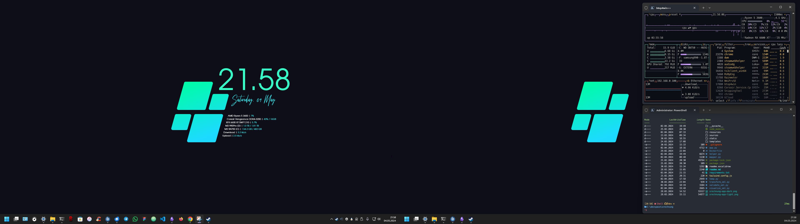

# :globe_with_meridians: init

 

$$
{{\color{Goldenrod}\Huge{ \texttt{ ...\ initialising\ symbiosis\ ... \}}}}\
$$

## hints
- :monkey: digging into html/web [..] since 56k modems
- :hammer: min-maxing hardware since geforce4 ti 4200
- :art: customizing windows since litestep 
- :honey_pot: mechanical keyboard fanboy
- 💾 dedicated gamer since doom 1
- :cat2: cats are my cryptonite

## current desktop

- terminal customization: OhMyPosh
- terminal monitor: btop4win
- desktop monitor, clock/date: rainmeter (customized cantarell skin)
- wallpaper: tba

## env
- tbc

## curent build and peripherals
- **CPU**: AMD Ryzen 5 3600 + Arctic 240mm AiO
- **MB**: Gigabyte Aorus B450 Pro
- **RAM**: Corsair Vengeance DDR4 3200, 2x8
- **GPU**: XFX 6600 XT SWFT
- **M2**: WD SN750, Samsung 990 Pro
- **PSU**: BQ Pure Power 11 CM 650W
- **CASE**: CM Qube 500
- **SCREEN1**: ASUS TUF VG249Q
- **SCREEN2**: BenQ GL2580H
- **KEYBOARD**: Ducky Mecha SF
- **MOUSE**: Steeelseries Aerox 3 WL
- **DESKMAT**: Corsair MM350 PRO
- **HEADSET**: Corsair HS80 WL
- **SPEAKER**: Teufel One Soundbar + T6 Subwoofer
- **MONITOR-ARMS**: Arctic X1-3D

## temp
- :headphones: addicted to hiphop
- :vhs: cinephile 
