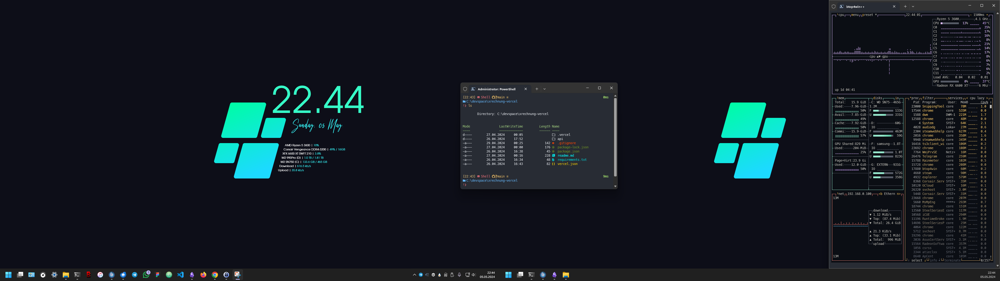

# :globe_with_meridians: init

 

$$
{{\color{Goldenrod}\Huge{ \texttt{ ...\ initializing\ symbiosis\ ... \}}}}\
$$

## hints
- :monkey: digging into html/web [..] since macromedia dreamweaver
- :hammer: crafting pc-builds since geforce4 ti 4200
- :art: customizing windows since win95 and litestep 
- :honey_pot: mechanical keyboard enthusiast
- 💾 dedicated gamer since doom 1
- :cat2: are my cryptonite
- :snowflake: jack of all trades

## knowledge/xp
| Segment    | Indicator | Synergy/Keywords |
| ---------- | --------- | -------- |
| HTML  |     | HTMX, Jinja |
| CSS |      | SASS/SCSS, Bootstrap, Tailwind |
| UI Prototyping    |     | Figma, FontAwesome |
| JS    |     | NodeJS, Express, Vue, jQuery |
| PHP    |     | Wordpress |
| Python    |     | Flask, Jinja |
| Databases/ORMs    |     | MySQL, SQLite  |
| CMS (+ headless)   |     | Wordpress, Kirby, Storyblok, Tina |
| DevOps    |     | Git, Docker, Vercel, Render |
| Dev Ecosystems    |     | Cloudogu, Cloud Foundry (SAP BTP) |
| SAP/ERP    |     | BTP, IDP/IAS, BAS, Cloud Foundry |
| XML    |     | XRechnung |
| Consumer Hardware    |     | - |
| Misc    |     | HUGO, Markdown |

*work in progress*

## current desktop

- OhMyPosh, btop4win, rainmeter (customized cantarell skin)

## core env
- win11 + winget + WSL + OpenSSH
- nodejs, docker, python, vscode, atom
- obsidian
- figma
- chrome, arc, thunderbird
- https://browsersync.io/

## current desk setup
- **CPU**: AMD Ryzen 5 3600 + Arctic 240mm AiO
- **MB**: Gigabyte Aorus B450 Pro
- **RAM**: Corsair Vengeance DDR4 3200, 2x8
- **GPU**: XFX 6600 XT SWFT
- **M2**: WD SN750, Samsung 990 Pro
- **PSU**: BQ Pure Power 11 CM 650W
- **CASE**: CM Qube 500 
- **SCREEN1**: ASUS TUF VG249Q
- **SCREEN2**: BenQ GL2580H
- **KEYBOARD**: Ducky Mecha SF
- **MOUSE**: Steelseries Aerox 3 WL
- **DESKMAT**: Corsair MM350 PRO
- **HEADSET**: Corsair HS80 WL
- **SPEAKER**: Teufel One Soundbar + T6 Subwoofer
- **MONITOR-ARMS**: Arctic X1-3D

## temp
- :headphones: addicted to hiphop
- :vhs: cinephile

- xp

| Segment    | Indicator | Synergy/Keywords |
| ---------- | --------- | -------- |
| Windows    |     | - |
| Linux    |     | - |
| CMD/Terminal   |     | - |
| Rading docs   |     | - |
| UML/modelling   |     | - |
| Giving a fuc*  |     | - |
| Not giving a fuc*  |     | - |
